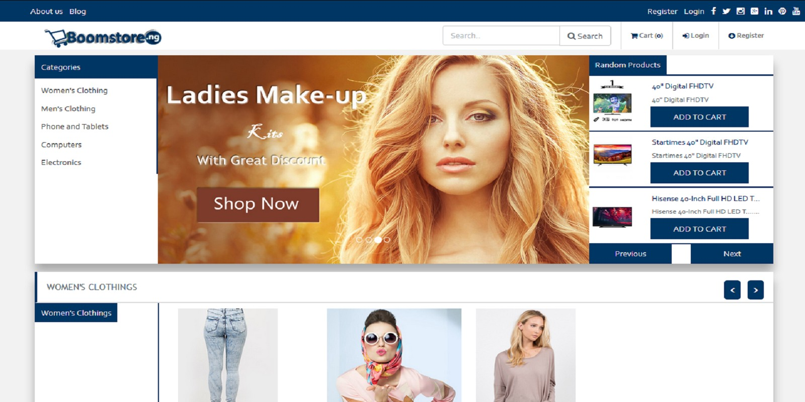

 
# Boomstore - eCommerce System PHP

Boomstore is a complete e-commerce system which provides both front-end and backend supports with a high level of security

### Live URL

https://boomstorebuy.000webhostapp.com/

## Overview

Often the art of writing a great product description that sells the product lies in the ability to describe the little things that make all the difference.

The little differences and features in a product that may seem trivial or boring to you are important to shoppers and help them make purchase decisions.

Boomstore, does just that.

## Features

- High Level of Security
- Ease of Use
- High-Resolution Photos and Video

## Requirements

The following are the requirements your sever must have

PHP 5.3 and above
Mysqli PHP Extension
Permissions

It required you give the following folders write access after you upload

storage/
config/

## Instructions

Installation
EXTRACT THE DOWNLOADED FILE CONTENT
Unzip the download files
Upload the content to your web root
Create Database
Create database with the method your server provided, mostly through PHPmyAdmin and take note of the following so as to make changes in .env file under DB_CONNECTION=mysql
Database name
Database user
Database password
Database host
Now run your website and follow the simple steps the interface provided
Logging in to the System
After a successfull installation from the above process
following this link www.yoursite.com

Login to your admin dashboard email: admin@admin.com password: password

### Thanks

Thanks for using Boomstore E-Commerce System, I'm very grateful, and keep expecting more features in future updates. Thanks...

## About Laravel

Laravel is a web application framework with expressive, elegant syntax. We believe development must be an enjoyable, creative experience to be truly fulfilling. Laravel attempts to take the pain out of development by easing common tasks used in the majority of web projects, such as:

- [Simple, fast routing engine](https://laravel.com/docs/routing).
- [Powerful dependency injection container](https://laravel.com/docs/container).
- Multiple back-ends for [session](https://laravel.com/docs/session) and [cache](https://laravel.com/docs/cache) storage.
- Expressive, intuitive [database ORM](https://laravel.com/docs/eloquent).
- Database agnostic [schema migrations](https://laravel.com/docs/migrations).
- [Robust background job processing](https://laravel.com/docs/queues).
- [Real-time event broadcasting](https://laravel.com/docs/broadcasting).

Laravel is accessible, yet powerful, providing tools needed for large, robust applications. A superb combination of simplicity, elegance, and innovation give you tools you need to build any application with which you are tasked.

## Learning Laravel

Laravel has the most extensive and thorough documentation and video tutorial library of any modern web application framework. The [Laravel documentation](https://laravel.com/docs) is thorough, complete, and makes it a breeze to get started learning the framework.

If you're not in the mood to read, [Laracasts](https://laracasts.com) contains over 900 video tutorials on a range of topics including Laravel, modern PHP, unit testing, JavaScript, and more. Boost the skill level of yourself and your entire team by digging into our comprehensive video library.

## Contributing

Thank you for considering contributing to the Laravel framework! The contribution guide can be found in the [Laravel documentation](http://laravel.com/docs/contributions).

## Security Vulnerabilities

If you discover a security vulnerability within Laravel, please send an e-mail to Taylor Otwell at taylor@laravel.com. All security vulnerabilities will be promptly addressed.

## License

The Laravel framework is open-sourced software licensed under the [MIT license](http://opensource.org/licenses/MIT).
